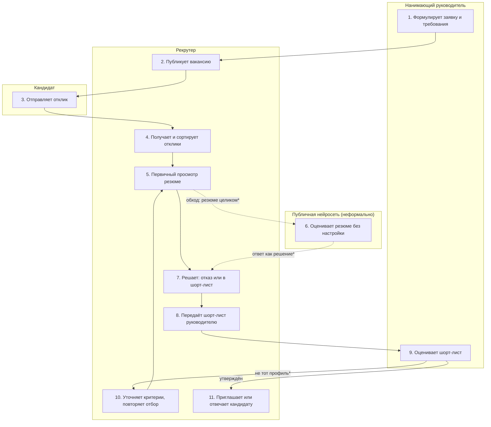

# Анализ процесса AS-IS

## Границы процесса

| Граница | Событие |
|---|---|
| Начало | Нанимающий руководитель сообщает рекрутеру о потребности в сотруднике и требованиях к кандидату |
| Конец | Кандидат получает статус по первичному отбору: приглашение на собеседование или отказ |
| Вне процесса | Собеседования и оценка софт-скиллов, оффер и выход сотрудника, внутренние кандидаты, поиск кандидатов рекрутером (sourcing) |

Процесс описан в 11 шагов (в пределах 7–15). Он обобщён по публичным
источникам, а не наблюдался в конкретной компании: интервью с рекрутером и
руководителем запланированы, непроверенные места помечены «гипотеза».

## Диаграмма процесса



Пунктир — обходной путь, который не предусмотрен регламентом (гипотеза).
\* — гипотеза, проверить в интервью.

## Шаги процесса

| # | Шаг | Роль | Вход | Выход | Система | Время | Частота | Ожидание |
|---|---|---|---|---|---|---|---|---|
| 1 | Формулирует заявку и требования | Нанимающий руководитель | Потребность в сотруднике | Описание вакансии; критерии неформализованы (гипотеза) | Почта или мессенджер (гипотеза) | н/д | 1 раз на вакансию | нет |
| 2 | Публикует вакансию | Рекрутер | Описание вакансии | Опубликованная вакансия | hh.ru | н/д | 1 раз на вакансию | нет |
| 3 | Отправляет отклик | Кандидат | Опубликованная вакансия | Отклик с резюме, часто автоотклик | hh.ru | н/д | 61 на вакансию (среднее hh.ru, офисные специалисты, 2026) | да |
| 4 | Получает и сортирует отклики | Рекрутер | Отклики | Очередь резюме на просмотр | hh.ru | н/д | 61 на вакансию | да |
| 5 | Первичный просмотр резюме | Рекрутер | Резюме с именем, полом, возрастом, фото | Решение «смотреть дальше или нет» за секунды | hh.ru | от 3–5 с до ≈1,5 мин на резюме | 61 на вакансию | нет |
| 6 | Оценивает резюме в публичной нейросети (обходной путь) | Рекрутер, публичная нейросеть | Резюме целиком, без настройки под вакансию | Ответ «подходит или нет» без заданных критериев | Публичный ИИ-чат (гипотеза) | н/д | Гипотеза: по части откликов | нет |
| 7 | Решает: отказ или в шорт-лист | Рекрутер | Итог просмотра или ответ модели | Шорт-лист; отказы без зафиксированного основания (гипотеза) | hh.ru | н/д | 61 на вакансию | нет |
| 8 | Передаёт шорт-лист руководителю | Рекрутер | Шорт-лист | Сообщение со списком кандидатов | Почта или мессенджер (гипотеза) | н/д | 1 раз на вакансию, плюс повторы | да |
| 9 | Оценивает шорт-лист | Нанимающий руководитель | Шорт-лист | Утверждение или возврат с пометкой «не тот профиль» | Почта или мессенджер (гипотеза) | Гипотеза: 1–3 рабочих дня | 1 и более раз на вакансию | да |
| 10 | Уточняет критерии, повторяет отбор | Рекрутер | Замечания руководителя | Новый шорт-лист по повторному просмотру откликов | hh.ru | н/д | Гипотеза: 1–2 итерации на вакансию | нет |
| 11 | Приглашает или отвечает кандидату | Рекрутер | Решение руководителя | Приглашение или отказ, часто без причины (гипотеза) | hh.ru | н/д | По каждому кандидату | нет |

«н/д» — не измерено: замеры запланированы в интервью с рекрутером и
руководителем.

## Источники данных

Все утверждения этого документа основаны на открытых документах; наблюдений и
интервью в конкретной компании ещё нет. Расхождение нормы и практики в
шагах 6 и 7 — гипотеза, которую интервью должно подтвердить или опровергнуть.

| Что утверждаем | Источник | Тип | Как получен |
|---|---|---|---|
| Рост откликов на вакансию 24 → 37 → 61 (шаги 3–5) | [И1] hh.ru, пересказ | метрика | Публичный пересказ данных hh.ru, первоисточник сверить на stats.hh.ru |
| Из ≈300 откликов подошли 35, то есть ≈12% (шаг 5) | [И2] Habr, кейс работодателя | документ | Статья одного работодателя; не универсальная оценка |
| Время на резюме от 3–5 с до ≈1,5 мин (шаг 5) | [И3] dengi.ua (TheLadders), incrussia.ru | документ | Статьи по исследованию eye tracking и оценке рекрутера |
| Фильтры отсеивают подходящих: ≈27 млн в США, 88% руководителей признают (шаг 5, 7) | [И4] HBS / Accenture | документ | Отчёт и его пересказы |
| Перекос моделей по имени и полу: 85% против 11% (шаг 6) | [И5] University of Washington | документ | Научное исследование открытых моделей |
| Иск о дискриминации при ИИ-скрининге (шаги 6–7) | [И6] Holland & Knight | документ | Юридический обзор |
| Автоотклики без сопроводительного письма (шаг 3) | [И7] Инфостарт, Habr | документ | Статья одной компании |
| Критерии «в голове» у руководителя, возврат шорт-листа, обход процесса через публичную нейросеть, отказы без основания (шаги 1, 6, 7, 9–11) | Команда | гипотеза | Построена командой, проверить в интервью с HR |

## Обнаруженные проблемы

| # | Проблема | Тип | Влияние | Источник |
|---|---|---|---|---|
| 1 | Критерии вакансии не формализованы и существуют в голове руководителя; рекрутер угадывает требования (шаги 1, 9) | НЕВИДИМОЕ ЗНАНИЕ | Шорт-лист возвращают, отбор повторяется (шаг 10), растёт срок закрытия вакансии | Гипотеза, интервью |
| 2 | Поток откликов растёт, значительная часть нерелевантна, каждое резюме просматривают вручную (шаги 4–5) | ЛИШНИЙ ШАГ | ≈1,5 ч на вакансию только на просмотр, около 88% времени уходит на неподходящие отклики (по кейсу И2) | [И1], [И2], [И3] |
| 3 | Решение принимается за секунды по неполным критериям, в данных видны имя, пол, возраст, фото (шаг 5) | ТОЧКА ОТКАЗА | Ошибочные отказы сильным кандидатам; формальные стоп-факторы (пробелы, стаж) отсеивают подходящих | [И4], [И5] |
| 4 | Резюме с персональными данными загружают в публичную нейросеть без настройки под вакансию и без правил (шаг 6) | ТОЧКА ОТКАЗА | Утечка персональных данных, воспроизведение смещений модели, неповторимый результат | Гипотеза; [И5], [И6] |
| 5 | Ответ модели принимают как готовое решение (шаги 6–7) | ТОЧКА ОТКАЗА | Подмена решения человека решением модели, ответственность размыта | Гипотеза; [И6] |
| 6 | Основание отказа не фиксируется, кандидату не объясняется (шаги 7, 11) | ТОЧКА ОТКАЗА | Решение нельзя проверить и оспорить; потеря доверия кандидата | Гипотеза; [И6] |
| 7 | Повторный просмотр откликов после возврата шорт-листа (шаги 9–10) | ДУБЛИРОВАНИЕ | Повторная трата времени рекрутера на те же резюме | Гипотеза, интервью |

Обходные пути: шаг 6 (нейросеть вне регламента) нужен для работы, потому что
экономит время на потоке из 61 отклика; решение «в обход регламента» признано
участниками — это гипотеза, подтверждение даст сильный аргумент в пользу
автоматизации с правилами. Остальные неформальные практики: просмотр «по
диагонали» и фактический просмотр только первых откликов (гипотеза).

## Оценка потерь

```text
Потери времени = (время ожидания + время обработки) × частота

Обработка первичного просмотра: 61 отклик × 1,5 мин = 91,5 мин ≈ 1,5 ч на вакансию
При 10 открытых вакансиях: ≈15 ч только на первичный просмотр
Доля нерелевантных откликов по кейсу И2: (300 − 35) / 300 ≈ 88%,
то есть ≈80 мин из 91,5 уходит на неподходящих (оценка по одному кейсу)
```

1,5 мин — верхняя оценка, при 3–5 с на резюме время на вакансию составляет
≈3–5 мин, но тогда выше риск ошибочных отказов (проблема 3). Время ожидания
в шагах 8–9 в расчёт не включено, замерим в интервью.

## Связь с этапом 1

| Проблема AS-IS | Противоречие из 01_problem.md |
|---|---|
| 1. Критерии не формализованы | Критерии остаются неформализованными при ускорении отбора |
| 2. Рост потока, ручной просмотр | Рост потока откликов (24 → 61) требует ускорения скрининга |
| 3. Решение за секунды по неполным данным | Необоснованные отказы, в том числе по скрытым признакам |
| 4. Публичная нейросеть без правил | Ускорение за счёт нейросетей без общих правил, юридические риски |
| 5. Ответ модели принимают как решение | Подмена решения рекрутера решением модели |
| 6. Основание отказа не фиксируется | Отказы необъяснимы для кандидата |
| 7. Повторный просмотр | Следствие проблемы 1: неформализованные критерии при ускорении отбора |

Методические указания: раздел «Методика → Как моделировать процесс AS-IS»
в репозитории `hrtech-practice`.

